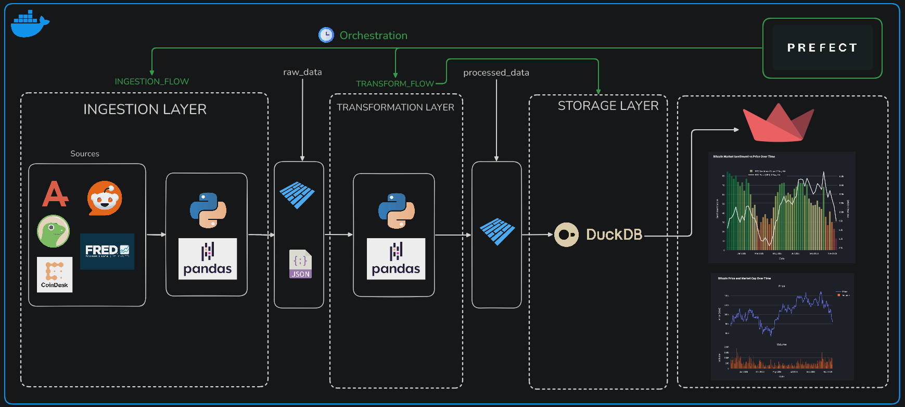

# BitScope

## Project Overview

BitScope is a comprehensive data pipeline and analysis project focused on the Bitcoin (BTC) ecosystem. It systematically ingests data from various sources, including cryptocurrency markets, economic indicators, and social media, to provide a holistic view of the factors influencing Bitcoin's valuation and perception.

The project is designed to be a full-fledged data engineering solution, demonstrating skills in data ingestion, transformation, storage, and visualization. It serves as a practical example of building a data-driven application for financial analysis.

Link to Streamlit Dashboard: [https://bitscope.streamlit.app/](https://bitscope.streamlit.app/)

---

## Data Pipeline Layers

The data pipeline is organized into distinct layers, each with a specific responsibility:

### 1. Ingestion Layer

This layer is responsible for extracting raw data from multiple external sources. The following data sources are currently integrated:

- **CoinGecko API**: Fetches historical Bitcoin market data, including prices, market capitalization, and trading volumes.
  - _URL_: `https://api.coingecko.com/api/v3/coins/bitcoin/market_chart/range`
- **Alternative.me API**: Retrieves the daily Fear & Greed Index, a measure of market sentiment.
  - _URL_: `https://api.alternative.me/fng/`
- **FRED API**: Ingests key economic indicators from the Federal Reserve Economic Data service, including:
  - Federal Funds Effective Rate (Interest Rates)
  - S&P 500 Index (SP500)
  - Consumer Price Index (CPI)
  - Unemployment Rate
  - _URL_: https://fred.stlouisfed.org/docs/api/fred
- **Reddit API**: Gathers posts from relevant subreddits (r/Bitcoin, r/btc, r/CryptoCurrency) to analyze social sentiment.
  - _URL_: `https://www.reddit.com/dev/api/`
- **Coindesk**: Scrapes opinion articles to capture media narratives and expert opinions.
  - _URL_: `https://www.coindesk.com/opinion`

### 2. Transformation Layer

Once the raw data is ingested, it is processed and transformed to be suitable for analysis. This includes:

- **Data Cleaning**: Handling missing values, correcting data types, and standardizing formats.
- **Normalization**: Scaling numerical data to a common range for comparative analysis.
- **Feature Engineering**: Creating new features from the raw data, such as moving averages or sentiment scores.
- **Data Modeling**: Structuring the data into a clean, queryable format, typically in a data warehouse or data mart.

### 3. Storage Layer

The project utilizes a hybrid storage solution to accommodate different types of data:

- **Raw Data**: Raw data is stored in Parquet and JSON files in a structured directory layout.
- **Processed Data**: Transformed data is stored in a DuckDB database, a fast, in-process analytical database.
- **Metadata**: A SQLite database is used to log metadata about the ingestion process, such as data sources, file paths, and timestamps.

### 4. Visualization and Analysis Layer

The final layer of the pipeline is focused on presenting the data in an accessible and insightful way. This is achieved through:

- **Interactive Dashboards**: A Streamlit application provides interactive dashboards for visualizing key metrics, historical trends, and correlations between different datasets.
- **Data Analysis**: The transformed data is used for various analyses, such as correlating social sentiment with price movements or understanding the impact of economic indicators on the Bitcoin market.

---

## Technologies Used

The project is built using a modern data stack, leveraging the following technologies:

| Category            | Technologies                                       |
| ------------------- | -------------------------------------------------- |
| **Orchestration**   | Prefect                                            |
| **Ingestion**       | Python (`requests`, `asyncpraw`, `beautifulsoup4`) |
| **Data Processing** | Pandas, DuckDB                                     |
| **Storage**         | Parquet, JSON, SQLite, DuckDB                      |
| **Visualization**   | Streamlit, Plotly, Matplotlib, Seaborn             |
| **API**             | FastAPI (for future development)                   |
| **Linting**         | Ruff                                               |

---

## Future Development

The project is under continuous development, with several enhancements planned for the future:

- **Automated Alerting**: Implementation of an automated alert system (e.g., via Telegram or email) to notify users of significant market events or anomalies.
- **Expanded Data Sources**: Integration of additional data sources, such as on-chain data, to provide a more comprehensive view of the Bitcoin network.
- **API Development**: Creation of a FastAPI-based API to serve processed data for external applications and services.
- **Enhanced Visualization**: Addition of more complex visualizations and user-customizable dashboards in the Streamlit application.
