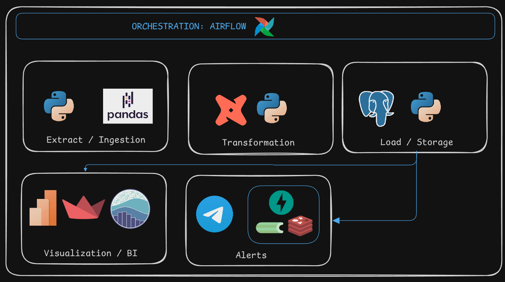

# BitScope 🚀

**Proyecto de análisis de datos de Bitcoin (BTC)** que integra precios, Fear & Greed Index, sentimiento social, noticias y alertas automáticas, con dashboards interactivos y pipelines reproducibles.

---

## 📌 Objetivo
Desarrollar un ecosistema de análisis de datos de BTC que permita generar **insights accionables**, visualizar métricas relevantes y automatizar alertas.  
Este proyecto sirve para mostrar habilidades en:  
- Data ingestion (ETL)  
- Transformación y modelado de datos  
- Análisis y visualización  
- Automatización y alertas  

---

## 🧩 Tecnologías
| Etapa | Herramientas |
|-------|--------------|
| Ingesta | Python (requests, pandas), FastAPI, Airflow / Prefect |
| Almacenamiento | PostgreSQL, SQLAlchemy / psycopg2 |
| Transformación | dbt, SQL (CTEs, joins, window functions) |
| Análisis / Visualización | Python (pandas, matplotlib, plotly), Power BI / Metabase / Streamlit / Dash |
| Automatización | FastAPI + Celery + Redis, Telegram Bot / Email API |

---

## ⚙️ Estructura del proyecto
crypto-lens/
│
├── data_ingestion/ # Scripts de extracción de datos
├── db/ # Scripts de creación de tablas y SQL
├── transformations/ # Scripts de limpieza y modelado
├── analytics/ # Dashboards y notebooks
├── alerts/ # Automatización de alertas
├── README.md
└── requirements.txt

yaml
Copy code

---

## 📈 Funcionalidades
- Descarga y almacenamiento diario de precios BTC y Fear & Greed Index.  
- Procesamiento de métricas derivadas y normalización de datos.  
- Correlación entre sentimiento social y precio.  
- Dashboards interactivos con métricas y gráficos históricos.  
- Alertas automáticas por Telegram o email cuando se cumplan condiciones relevantes.